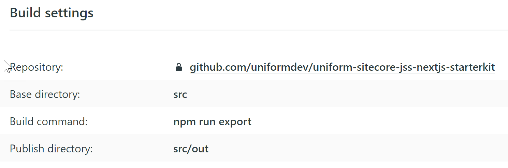
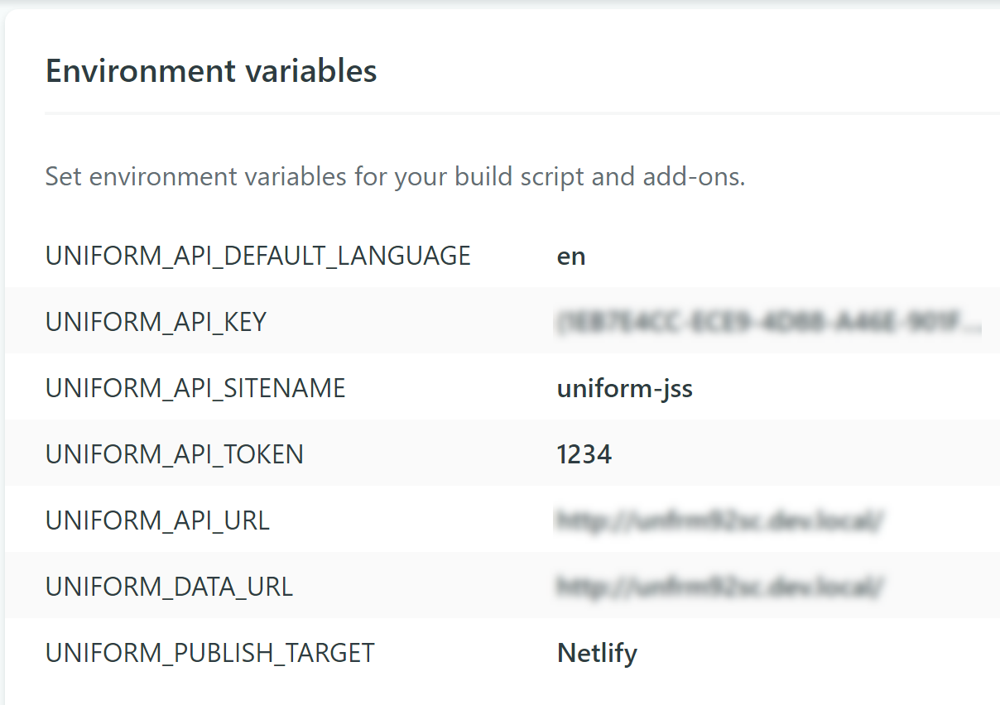
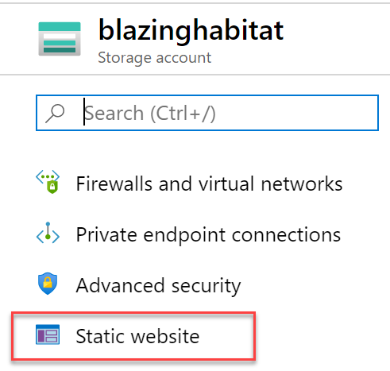
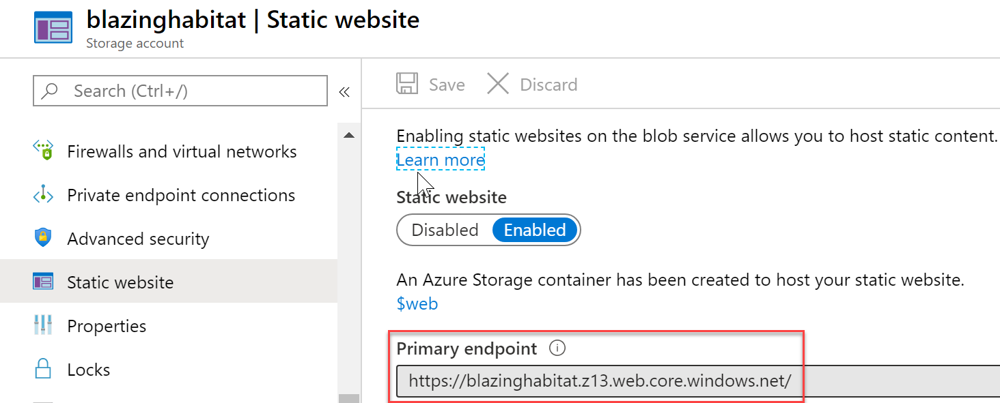

# Uniform starter kit for Sitecore JSS and Next.js

This repo contains both the starter kit and a sample JSS app with content to go with it, which is optional if you are connecting to an existing JSS app.

## Demo

This is the latest deployment of this starter, served from Netlify:
https://uniform-sitecore-jss-nextjs.netlify.com/

## Value prop

Uniform enables [JAMstack](https://jamstack.wtf/) style architecture for your Sitecore solution allowing to statically generate the whole site at build-time and deploy to your delivery platform of choice (this app is setup with Netlify, Azure and AWS S3 but it can work with virtually any combination of file/blob storage + CDN).

On top of that, Uniform unlocks **origin-less** tracking and personalization where marketing users assign personalization in Sitecore the usual way but **execution** part is deferred to the edge (depending on the CDN of choice) or client-side without paying the cost of going back to the origin content delivery server - unlocking the benefits of performance and scale of Content Delivery Networks with personalized experiences.

## Sitecore version compatibility

This starter kit is expected to work with any Sitecore 9.x version backend. This particular starter kit requires Sitecore JSS.

> If you are not planning on using Sitecore JSS, there are [other starter kits available](https://github.com/uniformdev).

## Next.js role

This starter kit is using [Next.js](https://nextjs.org/), a battleground tested React Framework, which is also capable of doing static site export, essentially acting as a static site generator.

There are multiple reasons why we are using Next.js in this context:

1. Leveraging outstanding server-side rendering option that Next.js provides out of the box. This is critical to retain Sitecore Experience Editor and Preview functionality.
1. Next.js comes with "batteries included". You have  routing, styling built-in as well as the plugin system and many other enhancements that improve Developer Experience and help with building fast sites.

## Repo structure

- `/content` - sample app content items (Unicorn items and the package).
- `/src` - the sources of the React/Next.js app wired up with Uniform plugin.
- `/docs` - documentation

## Pre-requisites
1. Node.js v10 or greater (check with `node -v`).
1. `Uniform.Sitecore.zip` package provided by the folks @ Uniform ([contact us for details](mailto:hi@unfrm.io)).
1. Uniform license key provided by the folks @ Uniform ([contact us for details](mailto:hi@unfrm.io)).
1. npm token provided by the folks @ Uniform ([contact us for details](mailto:hi@unfrm.io)).
1. Sitecore 9.x (9.0 -> 9.3) installed and up and running with Admin credentials available.
1. JSS.Server package (version dependent on your Sitecore version) installed and configured according to the official documentation.
1. Recommended to install Sitecore JSS CLI:
   
   `npm i @sitecore-jss/sitecore-jss-cli -g`

## Getting started disconnected

In this mode, you can do front-end development without the Sitecore back-end using Sitecore JSS Code-first workflow, learn more about this mode [here](https://jss.sitecore.com/docs/fundamentals/dev-workflows/code-first#code-first-workflow).

1. Set the `NPM_TOKEN` environment variable with the value we provided you with.

   You can use `$Env:NPM_TOKEN="your-npm-token here"` in PowerShell or `export NPM_TOKEN="your-npm-token here"` in Bash.

   > This variable is used within the `.npmrc` file located next to `package.json`
   > So alternatively, simply replace `${NPM_TOKEN}` within `.npmrc` file with the value we provided you with.

   ```bash
   //registry.npmjs.org/:_authToken=npm-token-guid
   ```

1. `npm install` from `/src` folder.

1. To run the app, use `npm run dev`.

> As of now, static export in disconnected mode is not supported.

## Integrating with the server-side

Once the Sitecore back-end is ready and available, you would need to configure Uniform and then you will be able to switch to being connected to the server-side.

### Step 1: server package installation and configuration

1. Deploy config files for this sample JSS app by copying the files from this repo's `/src/sitecore/config` folder to your Sitecore installation's `App_Config\Include\zzz` folder.
   > If you are not planning on using Unicorn for content item push to Sitecore, you would only need to deploy the "uniform-jss.config" file.

1. Update your Sitecore instance's `App_Config\ConnectionStrings.config` file by adding the following two connection strings:

   - `uniform.api.token` with the `1234` value:

     ```
       <add name="uniform.api.token" connectionString="1234" />
     ```

     > This value will be used to secure the deployment endpoint during Sitecore publishing and should be changed to a secret value in non-developer environments. The same value should be used when setting the `UNIFORM_API_TOKEN` environment variable (see below).

   - `Uniform.LicenseKey` with the value of Uniform license key you've received:
      ```
      <add name="Uniform.LicenseKey" connectionString="LICENSE-KEY-GOES-HERE" />
      ```
      
      Optionally, consider an alternative place for Uniform connection strings. Since these connection strings may not change frequently in development environment, consider adding these connection strings globally to IIS Manager (stored in `C:\Windows\Microsoft.NET\Framework64\v4.0.30319\config\web.config`):

      1.  Open IIS Manager
      1.  Select your computer name in the tree on the left
      1.  Select Connection Strings
      1.  Click Add in the right panel
      1.  Fill in the dialog with values from bulleted list above

      ```
      Name: connection-string-name
      ( ) SQL Server
      (x) Custom
         .------------------------
         | connection-string-value
      ```

1. Install the Uniform for Sitecore connector provided to you by Uniform team (`Uniform.Sitecore.zip` file) as a package via Sitecore Desktop => Installation Wizard.

   #### Validate the the server-side setup

   Verify everything is working by making request to `http://your-sitecore-instance/uniform/api/content/website/map`

   The last last part of the url above (`/website`) corresponds to the site name. So if you didn't deploy the sample JSS app from this repo using the steps above, this value will likely be different and will correspond to the site name your JSS app is associated with. If not sure, use `website`.

   The following response is expected (will be different if you are using another JSS app but JSON with the following structure is expected to be returned):

   ```json
   {
   "isPage": true,
   "lastModified": "2020-03-16T17:34:16",
   "revision": "5e40c005-c01e-4164-a555-59eb5a09d8eb",
   "children": {
      "about": {
         "isPage": true,
         "lastModified": "2020-03-16T17:34:16",
         "revision": "748dc8f3-a897-4681-bd7d-54b2495190ba",
         "children": {},
         "name": "About",
         "id": "0faa6199-bb54-455b-bacc-3b018c3fac1e",
         "template": "CommonPage"
      }
   },
   "name": "Home",
   "id": "5505b7b1-b454-459e-9d36-06a4d89755ad",
   "template": "CommonPage"
   }
   ```

### Step 2: Updating the next.js app

After the server-side is installed and configured, you will need to update your application to connect to the server-side.

1. Make sure you have `jss` CLI installed by running `jss --version` to check.

      If not, run `npm i @sitecore-jss/sitecore-jss-cli -g`.

1. Run `jss setup` and follow the directions in CLI.

   If you don't have a Sitecore API key created for your JSS app yet, create and configure it according to the official docs [here](https://jss.sitecore.com/docs/getting-started/app-deployment).

   > This API key will be used for the `UNIFORM_API_KEY` environment variable value below.

1. Provide the Sitecore connection details in environment variables

   Create `.env` file with connection details to your Sitecore dev instance.

   ```
   UNIFORM_API_KEY={guid of Sitecore JSS app API key item from the step above - same as you use for LayoutService}
   UNIFORM_API_URL=http://your-sc-host
   UNIFORM_DATA_URL=http://your-sc-host
   ```

   There are more environment variables available to specify - see [`uniform.config.js`](/src/uniform.config.js) file in `/src` folder for all default values. Naturally, these environment variables can be tweaked according to your environment specific by corresponding entries to the `.env` file:

   ```
   UNIFORM_API_TOKEN=1234
   UNIFORM_API_SITENAME=uniform-jss
   UNIFORM_API_DEFAULT_LANGUAGE=en
   ```
   > The value of `UNIFORM_API_TOKEN` should match what was provided as value for the `uniform.api.token` query string during server-side setup.

   > Note that the value of `UNIFORM_API_SITENAME` variable will depend on whether you are deploying this sample app to your Sitecore instance or you are connecting to your existing JSS app. If the latter, use the name of the site associated with the JSS app you'd like to connect to.

   > For multi-lingual solutions, if your are not using the default `en` language for your site's content, you will need to adjust the value of the `UNIFORM_API_DEFAULT_LANGUAGE` to the ISO code of the content language you are using.

   > Instead of specifying the `.env` file, you can use system environment variables instead.

1. (Optional) connecting via HTTPS.
   Add the following parameter if connecting to Sitecore instance over HTTPs, as you may experience connection issue due to the certificates:
   ```
    NODE_TLS_REJECT_UNAUTHORIZED=0
   ```

Now you are ready to develop connected to Sitecore back-end.
Start development server with `npm start` and open `http://localhost:3000/` to access the app.

### Step 3 - sample content deployment

**This step is optional**. If you don't have a JSS app deployed, but want to experience Uniform, not a problem! Follow the steps below to deploy required configs and content items for this sample app.

1. Deploy configs.

   Copy the configs from `sitecore\config` to your Sitecore instances' `App_Config\Include\zzz` folder.

1. Deploy content items.

- Option 1: install [the `Uniform SitecoreJSS Demo-items` package](/sitecore/Uniform%20SitecoreJSS%20Demo-items.0.0.1.zip) from this repo's `sitecore\` folder using Installation Wizard.

- Option 2: if you intend on using the JSS Code-first workflow:
   - `jss setup`
   - `jss deploy config`
   - `jss deploy items -c`

   This will perform JSS Code-first import of all developer artifacts as items as well as two content pages. Learn more about the Code-first workflow in the official Sitecore JSS docs [here](https://jss.sitecore.com/docs/fundamentals/dev-workflows/code-first#code-first-workflow). 

- Option 3: via [Unicorn](https://github.com/SitecoreUnicorn/Unicorn) (first, make sure Unicorn is installed and configured).
  1. copy the contents of the `sitecore\serialization` folder to your Sitecore instance's `App_Data\uniform-jss` folder, so the destination paths look like this:
     `\App_Data\uniform-jss\content` - `\App_Data\uniform-jss\layouts` - `\App_Data\uniform-jss\placeholders` - `\App_Data\uniform-jss\renderings` - `\App_Data\uniform-jss\templates`
  1. Open `https://your-sitecore-host/unicorn.aspx` while being logged into Sitecore.
  1. Click "Sync" the `Uniform.SitecoreJSS.Demo` configuration.

 > While this sample app is configured to serve content from master database (aka "Live mode"), when using "web" database for content, you may need to push some of these content items via workflow using Workbox to ensure those items are published to the "web" database.

### Step 4: test static site export

Once the content for your app is available in your Sitecore instance, you can run `npm run export` to perform build and export of your JSS app into the `/out` folder.

The process should complete with `"Export successful"`.

You can serve the static version with any file server now. To test, run `npx serve out` to verify the exported version renders as expected.

> "Serve" is a global npm package that will start a simple web server on http://localhost:5000

You are now ready to deploy your JSS app statically to virtually any target.

## Handling media / images

As of now, media/image support is not availble in public version of Uniform ([contact us](mailto:hi@unfrm.io) if you need this capability now).

In meantime, there are multiple alternatives as to how you can configure media handling for your JAMstackified Sitecore site:

1. Have your Sitecore Content Delivery origin handle Media Library requests (this is enabled with `Media.AlwaysIncludeServerUrl=true` setting enabled in `uniform-jss.config` config patch included in this repo).
1. Configure a "pull-based" CDN for Sitecore Media Library - [it is quite straightforward](https://doc.sitecore.com/developers/91/sitecore-experience-manager/en/manually-configure-the-sitecore-media-library-to-use-a-cdn.html). Besides the usual suspects, such as Akamai, Cloudflare and Cloudfront, there is a set of cool smart image CDNs to consider that are very much plug and play:
   - [CloudImage](https://www.cloudimage.io/)
   - [Cloudinary](https://cloudinary.com/)
   - [Piio](http://piio.co/)

## Site deployment

Site deployment consists of two phases:
1. Site export (also known as static site generation)
1. Copy of the statically exported artifacts to the target delivery environment.

This process can be initiated by:
1. A Sitecore publish command (useful in UAT, production environments where content authoring takes place).

1. Running export command in command line (useful in development and in CI)

Below are the steps to configure site deployment depending on your target environment of choice.

## Site deployment via command line

#### Option 1: Netlify

Netlify is known as a great platform for the JAMstack sites and it is not only the new origin for your built site, it is also the build environment.

1. Create an account at Netlify.com and log in.
2. Create new token via [Create a new personal access token](https://app.netlify.com/user/applications/personal) page
3. Add the following additional environment variables to the `.env` file located next to your `package.json` file.

   ```
   UNIFORM_PUBLISH_TARGET=Netlify
   NETLIFY_ACCESS_TOKEN=your-token-here
   ```

   > For convenience of your development environment, you may want to consider saving these as system environment variables instead (check [this guide](https://helpdeskgeek.com/how-to/create-custom-environment-variables-in-windows/) if unfamiliar with env variables).

4. Run `npm run deploy` to perform build, export and deployment to Netlify ADN.

   At the end of the process, the following message will be shown in console indicating success:

   ```
   Deploying wait-for-deploy start Waiting for deploy to go live...
   Deploying wait-for-deploy stop Deploy is live!
   NetlifyPublishProvider deployed site files: out
   ```

5. The Netlify site url will be shown in the newly created `netlify.config.json` file.

While this approach allows you to run the build on any server and deploy to Netlify, you would probably want to have Netlify do the build and deploy. This is easy - simply create a new site in Netlify connected to the fork of this repo in your git based source control and specify the same environment variables in build settings. In this case, you can skip specifying the `NETLIFY_ACCESS_TOKEN` environment variable.

When creating the site, specify the following build settings:



Afterwards, make sure that you add the following Environment variables in the newly created sites' dashboard under `/settings/deploys`:



The following environment variables are must haves:

```
UNIFORM_API_KEY={guid of API key item from the step above}
UNIFORM_API_TOKEN=1234
UNIFORM_API_URL=http://your-sc-host
UNIFORM_DATA_URL=http://your-sc-host
UNIFORM_API_SITENAME=uniform-jss
UNIFORM_API_DEFAULT_LANGUAGE=en
NPM_TOKEN=<the value of the npm token received from us>
```

Since Netlify will connect to your Sitecore instance, consider setting up a tunnel to your local Sitecore instance if you don't have it deployed publicly yet with something like ngrok: `ngrok http -host-header="ABCsc.dev.local" ABCsc.dev.local:80`

#### Option 2: Azure Blob Storage

**Pre-requisites**:
- Download [AzCopy](https://docs.microsoft.com/en-us/azure/storage/common/storage-use-azcopy-v10) tool and make it available on the same server that runs this next app (for simplicity, copy it into the root of this application).

**Configuration steps**:
1. Provision a Blob Storage account in Azure in the desired region.

1. Create a container called `$web`.

1. In Azure Portal, open the "Static website" settings for your Azure Blob container

   

1. Make sure this setting is enabled and it is associated with the `$web` container created above.

1. Copy the value of `Primary endpoint` into the clipboard. It should looks something along with this: `https://ABC.web.core.windows.net/`

   

1. Add the following additional environment variables to the `.env` file located next to your `package.json` file.

   ```
   # This is a path to azcopy, could be ./tools/azcopy.exe if you bring azcopy into the app root or any other path
   AZCOPY_PATH=./azcopy.exe

   UNIFORM_PUBLISH_TARGET=azureblob

   # This is the value of the "Primary endpoint" from the blob container:
   UNIFORM_PUBLISH_AZUREBLOB_PUBLIC_URL=https://ABC.web.core.windows.net/

   # name of the blob container:
   AZURE_CONTAINER=$web

   # Key 1 / connection string for your blob container:
   AZURE_STORAGE_CONNECTION_STRING=DefaultEndpointsProtocol=https;AccountName=...

   ```

   > The value for `AZURE_STORAGE_CONNECTION_STRING` can be retrieved from the "Access keys" page of your Azure Blob Storage account, under "Key 1 / Connection string".


To trigger deployment, run `npm run deploy`. This will perform the static app export and deployment of the exported static application artifacts to your Azure Blob storage container.

The static version of the JSS app is now expected to be served from this endpoint.

#### Option 3: AWS S3

1. Make sure you have the AWS credentials for a user with `AmazonS3FullAccess` policy. Specifically, the `Access key Id` and a `Secret access key`.

1. Add the following additional environment variables to the `.env` file located next to your `package.json` file.

   > For the time being, put an arbitrary value into `UNIFORM_PUBLISH_AWSS3_PUBLIC_URL`. After the first deployment, which also provisions the S3 bucket, the value for this variable can be extracted from `aws.config.json` file.

   ```
   UNIFORM_PUBLISH_TARGET=awss3
   AWS_ACCESS_ID=[AWS Access Key ID]
   AWS_SECRET=[AWS Secret access key]
   AWS_REGION=[AWS region for the S3 bucket creation]
   # the endpoint of your S3 bucket (ex: http://abc.s3-website-us-west-1.amazonaws.com/)
   UNIFORM_PUBLISH_AWSS3_PUBLIC_URL=[YOUR SITE URL]
   ```

   > For convenience of your development environment, you may want to consider saving these as system environment variables instead (check [this guide](https://helpdeskgeek.com/how-to/create-custom-environment-variables-in-windows/) if unfamiliar with env variables).

1. Run `npm run deploy`. This will provision the S3 bucket with "Static site hosting" settings and will deploy the contents of the `out` folder to it. At the end of the process, you should see the following in the console and the `aws.config.json` will be created in the project root:

   ```
   AwsS3PublishProvider deployed site files: out
   ```

#### Other deployment targets

Please [contact us](mailto:hi@unfrm.io) if your deployment to your CDN / hosting environment is not documented, it should be possible :)

### Site deployment via Sitecore publish

1. Ensure your site configuration corresponding to your JSS app has the `publishEndpoint` attribute with value pointing to your running Next server with Uniform plugin:  

   ```xml
         <site name="uniform-jss"
               ...
               publishEndpoint="http://localhost:3000" />
   ```

1. Ensure `UNIFORM_MODE` environment variable is set to `mixed`.
   ```
   UNIFORM_MODE=mixed
   ```

1. Start this app with `npm start`.
   
   Now that Next app is running, it is ready to accept deployment requests from your Sitecore Authoring server. 

1. Run site publishing.

## Other things you can do

### Server-side rendering development

- `npm run start:ssr`

This will start Next.js server under node and the app will work in SSR mode. This is needed for Preview and Experience Editor integrations.

### Setup with JSS Rendering Host

The rendering host middleware will be available in both disconnected and connected modes.

You need to setup your JSS app definition config in `uniform-jss.config`. Be sure the `<app />` definition looks something like below:

```

<app name="uniform-jss"
     sitecorePath="/sitecore/content/uniform-jss"
     useLanguageSpecificLayout="true"
     graphQLEndpoint="/api/uniform-jss"
     serverSideRenderingEngine="http"
     serverSideRenderingEngineEndpointUrl="http://localhost:3000/jss-render"
     inherits="defaults" />

```

Notice the `serverSideRenderingEngine` attribute is set to `http` and the `serverSideRenderingEngineEndpointUrl` is set to the host your Next+JSS app is running on.

### Setting up Preview server

WIP

### Adding origin-less tracking

WIP

### Adding origin-less personalization

WIP
